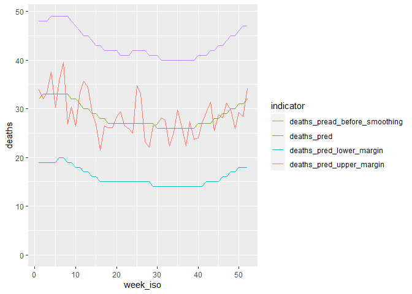
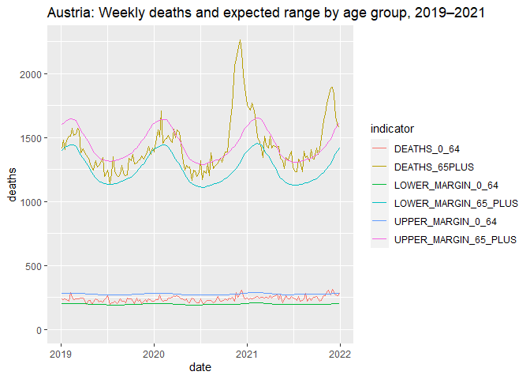

## Summary

The Vienna Mortality Monitoring Method is a demographic model aiming to compute the expected number of deaths in a given ISO calendar year ("prediction year") and in all respective ISO calendar weeks of the prediction year. The model is based on daily mortality data by year of birth from a reference period, which is defined as the five years previous to the prediction year. Population data by age from the beginning of the each year by age is required for each reference year as well as the prediction year.

The start and the end dates as well as week numbers of each reference year have to be standardised according to the ISO prediction year and its respective ISO calendar weeks. The daily numbers of deaths of each reference year are aggregated by age (at the beginning of the year) and (standardised) week. Population weights by age are applied to the numbers of weekly deaths by age.

In the first step of modeling, the weighted number of weekly deaths by age are aggregated by year. As a result, we obtain weighted numbers of annual deaths from each reference year (standardised to the prediction year). The expected number of annual deaths in the prediction year is calculated using linear regression.

In the second step of modeling, the median number of deaths of each week across all five years of the reference period is determined. The expected number of annual deaths of the prediction year are subsequently allocated proportionally to each week by the respective share of the median weekly values. The annual total expected number of deaths (from the first part) remains unchanged.

Finally, the expected numbers of weekly deaths from all weeks of all prediction years are arranged chronologically and smoothed using LOESS regression. The results are again grouped by year and used as the ratio of distribution in order to allocate the expected number of annual deaths (from step 1) proportionally one more time. This second round of allocation is necessary because the annual total expected number of deaths (from step 1) must not change, as mentioned before.

A Poisson probability distribution may be applied to the final expected numbers of weekly deaths to provide a range of values to support the identification of unusual mortality trends, i.e. excess mortality or mortality deficit.

A lack of data availability on the year of birth of the deceased can be resolved by adjusting the age at time of death.

In case the information on the year of birth (or age) of the deceased or population is not available, a simplified version of the model without population weighting of deaths can be employed. Thorough evaluations have shown that the quality of the results remains adequate when using linear extrapolation without applying any weights.

## Packages


```r
if (!require(tidyverse)) install.packages("tidyverse",repos="https://cran.rstudio.com/")
if (!require(lubridate)) install.packages("lubridate",repos="https://cran.rstudio.com/")
if (!require(ISOweek)) install.packages("ISOweek",repos="https://cran.rstudio.com/") 

require(tidyverse)
require(lubridate)
require(ISOweek)
```

## Input data


```r
download.file("https://raw.githubusercontent.com/Statistik-Wien/mortality-monitoring/main/pop_sample.csv", "pop_sample.csv")

download.file("https://raw.githubusercontent.com/Statistik-Wien/mortality-monitoring/main/deaths_sample.csv", "deaths_sample.csv")

pop = read_csv("pop_sample.csv") %>% mutate_if(is.numeric, as.integer)
deaths = read_csv("deaths_sample.csv")  %>% mutate_if(is.numeric, as.integer)
```


* **Population** (at the beginning of the year) by age from 0 to 100 years during the reference period and the prediction year
  + [Sample data](https://raw.githubusercontent.com/Statistik-Wien/mortality-monitoring/main/pop_sample.csv):

```r
pop
```

```
## # A tibble: 606 x 3
##     year   age residents
##    <int> <int>     <int>
##  1  2002     0      1155
##  2  2002     1      1201
##  3  2002     2      1235
##  4  2002     3      1301
##  5  2002     4      1370
##  6  2002     5      1376
##  7  2002     6      1423
##  8  2002     7      1514
##  9  2002     8      1601
## 10  2002     9      1529
## # ... with 596 more rows
```

* **Deaths** by date of death and age at the beginning of the year of death from 0 to 100 years during the reference period.
*Deaths with date of birth after the beginning of the year are assigned to age 0. The reference period data should include the 3 previous and subsequent days from the reference period calendar years, e.g.: If the reference period is 2002–2006, the data should include all deaths from 29 Dec 2001 to 3 Jan 2007.*
  + [Sample data](https://raw.githubusercontent.com/Statistik-Wien/mortality-monitoring/main/deaths_sample.csv):

```r
deaths
```

```
## # A tibble: 6,724 x 3
##    date         age deaths
##    <date>     <int>  <int>
##  1 2001-12-28    80      1
##  2 2001-12-28    91      1
##  3 2001-12-29    56      1
##  4 2001-12-29    71      1
##  5 2001-12-29    76      1
##  6 2001-12-29    78      1
##  7 2001-12-29    79      1
##  8 2001-12-29    84      1
##  9 2001-12-29    89      1
## 10 2001-12-31    60      1
## # ... with 6,714 more rows
```

## Preparing data
Using sample data, we aim to predict deaths in the year 2007 based on a reference period from 2002 to 2006.


```r
pred_year = 2007L
ref_years = c(2002L:2006L)
```

### Population

Calculate population weights for all reference years in relation to the prediction year.


```r
pop = pop %>% 
  group_by(age) %>% 
  mutate(residents_pred_year = sum(residents[year == pred_year])) %>% 
  ungroup() %>% 
  mutate(weight = replace_na(residents_pred_year / residents, 1))

pop
```

```
## # A tibble: 606 x 5
##     year   age residents residents_pred_year weight
##    <int> <int>     <int>               <int>  <dbl>
##  1  2002     0      1155                1121  0.971
##  2  2002     1      1201                1194  0.994
##  3  2002     2      1235                1269  1.03 
##  4  2002     3      1301                1252  0.962
##  5  2002     4      1370                1261  0.920
##  6  2002     5      1376                1306  0.949
##  7  2002     6      1423                1303  0.916
##  8  2002     7      1514                1333  0.880
##  9  2002     8      1601                1400  0.874
## 10  2002     9      1529                1450  0.948
## # ... with 596 more rows
```

### Deaths

ISO years need not start on 1 January. Instead of 365 days, ISO years comprise either 364 or 371 days. Each reference year must therefore be adjusted (standardised) to the dates (and therefore length) of the prediction year.

ISO prediction year 2007 starts on 1 Jan 2007 and ends on 30 Dec 2007. Each reference year will also start on 1 Jan and end on 30 Dec.


```r
# 1. Find out on which dates the ISO prediction year starts and ends and create a date sequence with ISO week numbers

pred_year_cal = tibble(
  date = seq(ISOweek2date(paste0(pred_year, "-W01-1")), # First day of ISO week 1 from the ISO prediction year
             ISOweek2date(paste0(pred_year + 1, "-W01-1")) - 1, # Last day of last ISO week from ISO prediction year.
      1)) %>% # Sequence by days
    mutate(week_iso = isoweek(date),
           year_iso = isoyear(date)) %>%
    mutate_if(is.numeric, as.integer)

pred_year_cal
```

```
## # A tibble: 364 x 3
##    date       week_iso year_iso
##    <date>        <int>    <int>
##  1 2007-01-01        1     2007
##  2 2007-01-02        1     2007
##  3 2007-01-03        1     2007
##  4 2007-01-04        1     2007
##  5 2007-01-05        1     2007
##  6 2007-01-06        1     2007
##  7 2007-01-07        1     2007
##  8 2007-01-08        2     2007
##  9 2007-01-09        2     2007
## 10 2007-01-10        2     2007
## # ... with 354 more rows
```


```r
# 2. Standardise the reference years according to the ISO prediction year
## If a prediction year contains 29 Feb and a reference year does not, 28 Feb is used instead. This might cause a warning message from R.

ref_years_cal = tibble()
  
for (i in seq_along(ref_years)) {
  k = pred_year_cal %>% 
      mutate(year_iso = pred_year - i,
             date = ymd((year(date) - i) * 10000 + month(date) * 100 + day(date)),
             date = case_when(
               is.na(date) ~ lag(date),
               T ~ date))
    
    ref_years_cal = bind_rows(ref_years_cal, k)
}

rm(i, k)
  
ref_years_cal
```

```
## # A tibble: 1,820 x 3
##    date       week_iso year_iso
##    <date>        <int>    <int>
##  1 2006-01-01        1     2006
##  2 2006-01-02        1     2006
##  3 2006-01-03        1     2006
##  4 2006-01-04        1     2006
##  5 2006-01-05        1     2006
##  6 2006-01-06        1     2006
##  7 2006-01-07        1     2006
##  8 2006-01-08        2     2006
##  9 2006-01-09        2     2006
## 10 2006-01-10        2     2006
## # ... with 1,810 more rows
```


```r
# 3. Join death figures with the standardised reference year date sequence and check for dates without deaths - this might indicate a problem
deaths_ref_years = ref_years_cal %>%
  left_join(deaths, by = c("date"))

if (is.na(sum(deaths_ref_years$deaths))) {
    print("Watch out, there are some days without deaths. This might indicate a data issue.")
deaths_ref_years %>% filter(is.na(deaths))
} else {
  print("OK, no days without deaths!")
}
```

```
## [1] "Watch out, there are some days without deaths. This might indicate a data issue."
```

```
## # A tibble: 35 x 5
##    date       week_iso year_iso   age deaths
##    <date>        <int>    <int> <int>  <int>
##  1 2006-04-07       14     2006    NA     NA
##  2 2006-06-02       22     2006    NA     NA
##  3 2006-06-07       23     2006    NA     NA
##  4 2006-06-08       23     2006    NA     NA
##  5 2006-06-17       24     2006    NA     NA
##  6 2006-07-14       28     2006    NA     NA
##  7 2006-09-03       36     2006    NA     NA
##  8 2006-10-01       40     2006    NA     NA
##  9 2006-10-18       42     2006    NA     NA
## 10 2005-02-24        8     2005    NA     NA
## # ... with 25 more rows
```

```r
# Ignore days without deaths
deaths_ref_years = deaths_ref_years %>% 
  mutate_at(vars(age, deaths) , ~replace_na(., 0)) #Keep days with 0 deaths in dataset (explicit)
```


```r
# 3a. Aggregate deaths by standardised weeks and age
deaths_ref_years = deaths_ref_years %>% 
  group_by(year_iso, week_iso, age) %>% 
  summarise(deaths = sum(deaths)) %>% 
  ungroup() %>% 
  mutate_at(vars(-deaths), as.integer)
```


```r
# 4. Join date sequence of standardised death data with population weights, apply weights and aggregate standardised age groups by ISO year and ISO weeks
deaths_ref_years = deaths_ref_years %>%
  left_join(pop %>% select(year, age, weight), by = c("year_iso" = "year", "age")) %>% 
  mutate(deaths_weight = deaths * weight) %>% 
  group_by(year_iso, week_iso) %>% 
  summarise(deaths_weight = sum(deaths_weight))

deaths_ref_years
```

```
## # A tibble: 260 x 3
## # Groups:   year_iso [5]
##    year_iso week_iso deaths_weight
##       <int>    <int>         <dbl>
##  1     2002        1          46.7
##  2     2002        2          22.5
##  3     2002        3          35.5
##  4     2002        4          44.4
##  5     2002        5          36.6
##  6     2002        6          41.2
##  7     2002        7          44.4
##  8     2002        8          28.7
##  9     2002        9          32.4
## 10     2002       10          27.3
## # ... with 250 more rows
```

We now have a dataset with the weekly number of deaths for our reference years standardised by the ISO week scheme and population size/structure of the prediction year.

## Model
### Predicting annual number of deaths
In the first step, the total number of deaths in the prediction year is determined by using linear regression.

```r
predict_deaths = function(ref_year_data) {
  return(predict(glm(deaths_weight ~ year_iso,
                     data = ref_year_data),
                 tibble(year_iso = pred_year)))
  }
```


```r
deaths_pred_year = deaths_ref_years %>% 
  group_by(year_iso) %>% 
  summarise(deaths_weight = sum(deaths_weight))

deaths_pred_year = as.integer(round(predict_deaths(deaths_pred_year), 0))

print(paste0("Estimated deaths in prediction year ", pred_year, ": ", deaths_pred_year))
```

```
## [1] "Estimated deaths in prediction year 2007: 1493"
```

### Predicting weekly number of deaths
The total number of annual deaths in the prediction year is now allocated to each ISO week. This takes several rounds to ensure seamless smoothing across several prediction years. The annual total expected number of deaths, which was calculated in the previous step, must not change.


```r
# 1. Determine median number of deaths per ISO week in reference period
deaths_pred_weeks = deaths_ref_years %>% 
  group_by(week_iso) %>% 
  summarise(deaths_weight_median = median(deaths_weight)) %>% 
  ungroup()
```


```r
# 2. The expected number of annual deaths of the prediction year is allocated proportionally to each week according to the median weekly values
deaths_pred_weeks = deaths_pred_weeks %>% 
  mutate(deaths_pred_year_week_r1 = deaths_pred_year * (deaths_weight_median / sum(deaths_weight_median)))
```


```r
# 3. Smoothing should be performed across several prediction years in order to ensure seamless transitinons across several years. For the purpose of demonstration, we use the results from our demo prediction year 2007 as predictions years 2006 and 2008.
deaths_pred_weeks = bind_rows(deaths_pred_weeks %>% mutate(year_iso = 2006),
                              deaths_pred_weeks %>% mutate(year_iso = 2007),
                              deaths_pred_weeks %>% mutate(year_iso = 2008))

deaths_pred_weeks = deaths_pred_weeks %>% 
  mutate(row_n = min_rank(year_iso * 100 + week_iso),   #row numbers for even smoothing
         deaths_pred_year_week_r2 = predict(loess(deaths_pred_year_week_r1 ~ row_n,
                                                  span =
                                                    0.5 / length(unique(deaths_pred_weeks$year_iso))^(1/1.2))))
#Formula we recommend to calculate smoothing span
```


```r
# 4. Just as in round 1, the expected total number of annual deaths need to be allocated proportionally again to each week according to the smoothed weekly values, because the annual total must not change due to week allocation and smoothing.
deaths_pred_weeks = deaths_pred_weeks %>% 
  group_by(year_iso) %>% 
  mutate(deaths_pred_year_week_r3 =
           deaths_pred_year * (deaths_pred_year_week_r2 / sum(deaths_pred_year_week_r2))) %>%
  ungroup()

#Check
deaths_pred_year * 3 == sum(deaths_pred_weeks$deaths_pred_year_week_r3)
```

```
## [1] TRUE
```

A Poisson probability distribution (we recommend p = 0.01) may be applied to the final expected numbers of weekly deaths to provide a range to support the identification of unusual mortality trends, i.e. excess mortality or mortality deficit.


```r
#After rounding the weekly number of deaths, the total annual number of deaths does in fact change slightly; add prediction intervals
deaths_pred_weeks = deaths_pred_weeks %>% 
  mutate(deaths_pred = as.integer(round(deaths_pred_year_week_r3, 0)),
         deaths_pred_lower_margin = as.integer(qpois(0.005, deaths_pred_year_week_r3)),
         deaths_pred_upper_margin = as.integer(qpois(0.995, deaths_pred_year_week_r3)))
```


## Results

```r
deaths_pred_weeks %>%
  filter(year_iso == 2007) %>%
  select(week_iso, deaths_pred, deaths_pred_lower_margin, deaths_pred_upper_margin)
```

```
## # A tibble: 52 x 4
##    week_iso deaths_pred deaths_pred_lower_margin deaths_pred_upper_margin
##       <int>       <int>                    <int>                    <int>
##  1        1          32                       19                       48
##  2        2          33                       19                       48
##  3        3          33                       19                       48
##  4        4          33                       19                       49
##  5        5          33                       19                       49
##  6        6          33                       20                       49
##  7        7          33                       20                       49
##  8        8          33                       19                       49
##  9        9          32                       19                       48
## 10       10          32                       18                       47
## # ... with 42 more rows
```

```r
deaths_pred_weeks %>% 
  filter(year_iso == 2007) %>% 
  select(week_iso, deaths_pred, deaths_pred_year_week_r1, deaths_pred_lower_margin, deaths_pred_upper_margin) %>% 
  rename(deaths_pread_before_smoothing = deaths_pred_year_week_r1) %>% 
  pivot_longer(c(2:5), names_to = "indicator", values_to = "deaths") %>% 
  ggplot(aes(week_iso, deaths, group = indicator, color = indicator)) +
    geom_line() +
    ylim(0, NA)
```

<!-- -->

## Use case
Statistics Vienna has developed and used the Mortality Monitoring Methodology since April 2020 to evaluate weekly mortality trends in Austria’s nine provinces with regard to unusual events. We predict weekly mortality since 2007 for the two age groups 0 to 64 years and 65 years and older (https://wien1x1.at/mortality-provinces).


```r
# Download Statistics Vienna Mortality Monitoring and plot
download.file("https://www.wien.gv.at/gogv/l9ogdmortalitaetmonatlich", "mm.csv")
mm = read_csv2("mm.csv", skip = 1) %>% mutate_if(is.numeric, as.integer)
```


```r
mm %>% 
  filter(NUTS == "AT", REF_YEAR_ISO %in% c(2019:2021)) %>% 
  mutate(date = ISOweek2date(paste0(REF_WEEK_ISO %/% 100, "-W", substr(REF_WEEK_ISO, 5, 6), "-4"))) %>% 
  pivot_longer(c(5:6, 9:12), names_to = "indicator", values_to = "deaths") %>% 
  ggplot(aes(date, deaths, group = indicator, color = indicator)) +
    geom_line() +
    ggtitle("Austria: Weekly deaths and expected range by age group, 2019–2021") +
    ylim(0, NA)
```

<!-- -->


## Adaptations
### Bulk operations
The code may be refined for bulk operations, i.e. the prediction of the number of deaths in different regions or by broad age groups. Use grouping variables and tidyverse *group_by* operations for data preparation and *nest* and *map* operations for modeling!

As already noticed, it makes sense to predict more than one year in order to perform cross-year smoothing and to obtain more accurate weekly predictions at the beginning and the end of the year (where LOESS tends to unravel). To achieve this, we packed almost the entire data preparation and model code into a function, except the prediction of weekly deaths. The function is called in a loop along all prediction years and results are bound together. The prediction of weekly deaths is performed afterwards.

### Predicting months instead of weeks
The model may easily be adapted to predict the number of expected deaths per month (instead of weeks) by adjusting step #1 of deaths data preparation ("...create a date sequence..."). This might be especially useful if deaths data are only available at month level (see below at the Workarounds section). Instead of ISO week numbers, month numbers may be used. Don't get confused if you keep the original variable names (*week_iso* and *year_iso*) from the code demo. You might need to adjust the LOESS smoothing span in the last part.


```r
#Create a date sequence with month numbers

pred_year_cal = tibble(
  date = seq(ymd(pred_year * 10000 + 101), # First day of prediction year
             ymd(pred_year * 10000 + 1231), # Last day of prediction year.
      1)) %>% # Sequence by days
    mutate(week_iso = month(date),
           year_iso = year(date)) %>%
    mutate_if(is.numeric, as.integer)
```


### Workarounds for lack of data
#### Use age at time of death instead of year of birth
A lack of data availability on the year of birth (i.e. age at the beginning of the year) of the deceased can be made up for by using an adjusted version of the age at time of death. Please note: Age at time of death data must be available from ages 0 to 101 (instead of just 100). When preparing deaths data and before weighting (i.e. before #4), the age at time of death must be shifted back by six moths. (On average, the age at time of death is the age at the beginning of the year plus six months). Since our age variables are discrete (integers), the rejuvenation process is a bit tricky:


```r
# 3b Workaround if age of deceased at the beginning of the year is missing
## All ages must be present in the data
deaths_ref_years = deaths_ref_years %>% 
  mutate(age = factor(age, levels = c(0:101))) %>% 
  complete(year_iso, week_iso, age, fill = list(deaths = 0)) %>% 
  mutate(age = as.integer(levels(age))[age])

## Move 1/2 of each age group down
## Age 0 cannot move down; Ages 101 and 100 are aggregated after the process
deaths_ref_years = deaths_ref_years %>% 
  arrange(year_iso, week_iso, age) %>% 
  group_by(year_iso, week_iso) %>% 
  mutate(deaths_new = (deaths + lead(deaths)) / 2,
         deaths_new = ifelse(age == 0, deaths + lead(deaths) / 2, deaths_new),
         deaths_new = ifelse(age == 100, deaths / 2 + lead(deaths), deaths_new)) %>% 
  filter(age < 101) %>% 
  select(-deaths) %>% 
  rename(deaths = deaths_new)
```

#### No population or age data available 
In case the information on the year of birth (or age) of the deceased or population structure is not available, a simplified version of the model without population weighting of the number of deaths can be employed. Thorough evaluations have shown that the quality of the results remains adequate using linear extrapolation without applying weights.

To use our code with the simplified methodology, create a dummy population dataset just before calculating population weights.


```r
# Create dummy population dataset
pop = crossing(year = c(ref_years, pred_year), age = c(0L:100L), residents = 1L)
```

#### Deaths data not available by days
If data on deaths is not available by days, but instead by (ISO) weeks (like with the demo_r_mweek3 dataset from Eurostat), we recommend to slice weekly deaths proportionally into the average number of daily deaths according to the week calender system used (e.g. ISO). I.e.: 700 deaths in week 1-2002 are disaggregated into 7 days from 31 Dec 2001 to 6 Jan 2002 with 100 deaths each. Please be aware to include the weeks immediately previous and subsequent to the reference period during week-to-day slicing in order to capture all dates of the prediction year; remember: ISO years might start as early as 29 Dec of the previous year and end on 3 Jan of the subsequent year.


```r
# Disaggregate weekly deaths proportionally to daily deaths (ISO weeks)

# Calender with all dates needed
cal_helper = tibble(date = seq(ymd((min(ref_years) - 1) * 10000 + 1229),
                               ymd((pred_year + 1) * 10000 + 103), by = "days")) %>%
  mutate(year_iso = isoyear(date),
         week_iso = isoweek(date))

# Join weekly deaths to the calender (divided by 7)
deaths = cal_helper %>% 
  left_join(deaths_weeks %>% mutate(deaths = deaths / 7),
             by = c("year_iso", "week_iso"))

# Check for missing values in deaths before proceeding!

rm(cal_helper)
```


## Acknowledgments
In the development of our methodology, we have received valuable support from our colleague Christoph Junker at the Swiss Federal Statistical Office (BFS), as well as from Johannes Klotz.

## References
Bauer R., Speringer M., Frühwirt P., Seidl R. and Trautinger F. (2022): Assessing excess mortality in Vienna and Austria after the first year of the COVID-19 pandemic. Vienna Yearbook of Population Research 2022. https://www.austriaca.at/?arp=0x003d2f56

BFS – Federal Statistical Office, Switzerland (ed.) (2020): Mortality, causes of death. https://www.bfs.admin.ch/bfs/en/home/statistics/health/state-health/mortality-causes-death.html

Karlinsky A. and Kobak D. (2021): Tracking excess mortality across countries during the COVID-19 pandemic with the World Mortality Dataset. eLife. https://elifesciences.org/articles/69336

Statistics Vienna (ed.) (2020): Mortality Monitoring in Austria’s Provinces since 2020. City of Vienna. https://wien1x1.at/mortality-provinces

Statistics Vienna (ed.) (2020): Mortality Monitoring in European countries and cities since 2020. City of Vienna. https://wien1x1.at/mortality-europe
